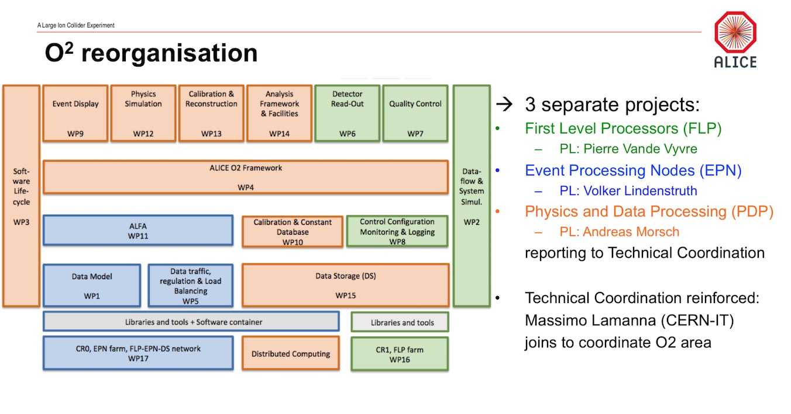

+++
author = " "
tags = [ "talks", "mrrtf" ]
headline = " "
homebutton = true
printbutton = true
theme = "lasimple"
center = true
controls = false
transition = "none"
timeline = false
code_theme = "tomorrow-night"
title = "MUON O2 Session"
date = 2019-04-04
draft = false
footer = "L. Aphecetche | MUON O2 Session | April 4th 2019"
+++

## O 2/3

---

## A note on constrains

<svg class="constrains" width="600" height="600" viewBox="0 0 600 600" preserveAspectRatio="xMidYMid meet" fill="none" xmlns="http://www.w3.org/2000/svg" style="text-anchor: middle; font-size: 26px; ">
<rect width="600" height="600" fill="white"/>
<circle cx="306" cy="130" r="74.5" stroke="black"/>
<circle cx="466" cy="436" r="74.5" stroke="black"/>
<circle cx="156" cy="436" r="74.5" stroke="black"/>
<path d="M233 437H390" stroke="black"/>
<path d="M159 362L258 189" stroke="black"/>
<path d="M450 362L351 189" stroke="black"/>
<text x="306" y="130" fill="black" style="alignment-baseline: middle">quality </text>
<text x="466" y="436" fill="black" style="alignment-baseline: middle">time</text>
<text x="156" y="436" fill="black" style="alignment-baseline: middle">resources</text>
</svg>

---

## Agenda

### A mix of MCH, MFT and MID.

- MCH Simulation
- MFT Simulation
- MCH Tracking
- MFT Reconstruction
- MFT QC
- Mchview
- MID Reconstruction and Simulation
