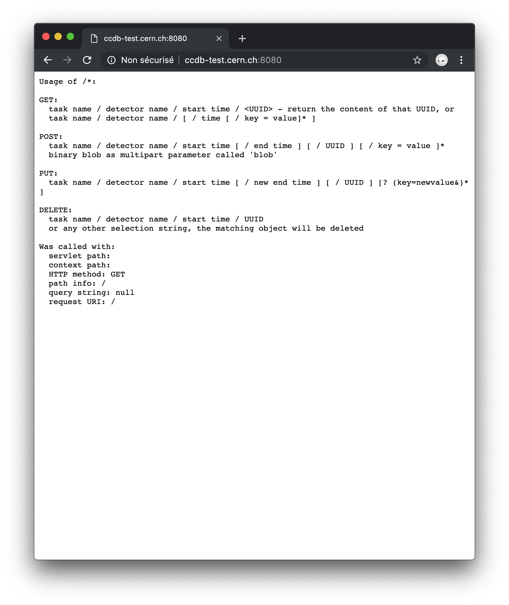

+++
author = "Laurent Aphecetche"
tags = [ "talks", "mrrtf" ]
headline = " "
homebutton = true
printbutton = true
theme = "lasimple"
center = true
controls = false
transition = "none"
timeline = false
code_theme = "tomorrow-night"
title = "MchView 2.0"
date = 2019-04-04
draft = false
footer = "L. Aphecetche | MchView 2.0 | April 4th 2019"
+++

## Current mchview

- based on old Root GUI
- visually and technically outdated
- difficult to maintain
- difficult to develop further

---

## Replace with something

- with a better looking UI.
- easier to develop
- easier to maintain
- easier to use from ~anywhere
- with more origins for data sources (e.g. clusters...)

Using web technologies (HTML/CSS/JS)

---

## The mockup


---

## UI elements


---

## UI elements = components

- Each component can be developped independently
- and plugged/reused easily in different views
- defined within a Javascript framework ([Mithril](https://mithril.js.org) or [React](https://reactjs.org))

---

## Data access

Clearly separated from UI

Using external APIs as much as possible

Those APIs might be used outside mchview as well

---

## Mapping as a service

Not strictly _required_ to be an API

But using it as a playground for API dev

One advantage (for mchview) is that it loads only what is needed for a view

---

## Mapping API

Entry point gives you a help.


---

## Mapping API example

`?dualsampas` URLs gives you the shape of dual sampas

In JSON format.


---

### The same, formatted for humans

```json
{
  "DualSampas": [
    {
      "ID": 1025,
      "Vertices": [
        {
          "X": 20,
          "Y": 0
        },
        {
          "X": 20,
          "Y": -20
        },
        {
          "X": 39.999999992,
          "Y": -20
        },
        {
          "X": 39.999999992,
          "Y": 0
        },
        {
          "X": 20,
          "Y": 0
        }
      ],
      "Value": 0
    },
    {
      "ID": 1026,
      "Vertices": [
        {
          "X": 0,
          "Y": 0
        },
        {
          "X": 0,
          "Y": -20
        },
        {
          "X": 19.999999992,
          "Y": -20
        },
        {
          "X": 19.999999992,
          "Y": 0
        },
        {
          "X": 0,
          "Y": 0
        }
      ],
      "Value": 0
    }
  ]
}
```

---

## CCDB API

That one _is_ the official O2 CCDB one (WP10).

See e.g. this talk by [Costin](https://indico.cern.ch/event/806602/contributions/3362638/attachments/1822111/2980985/WP10_-_2019-04-02.pdf)



---

## CCDB JSON API

A lightweight front-end to the CCDB to convert Root (muon) calibration objects
to JSON format

The API that might be used by mchview to get calib data

(very _alpha_ software. see [serve-ocdb](https://github.com/aphecetche/ocdb/tree/serve-ocdb) branch of [alice-go](https://github.com/alice-go/aligo) repo)

---

## Current status

- Not quite as the mockup (yet)
- more a proof-of-concept for the moment
- but seems viable...

---

## Trying it locally

```
> git clone https://github.com/mrrtf/mchview.git

> echo "MCHVIEW_PORT=4444\nMCH_MAPPING_API=http://mchmapping.aphecetche.me:3333\n
MCH_MAPPING_API_PORT=3333\n" > .env
```

### With Docker

```
> docker compose up -d mchview
```

### With npm

```
> npm install && npm start
```

Open browser at `http://localhost:4444`

---

## Try it on the web

[MchView proto](http://mchmapping.aphecetche.me:5678)

---

## Code

https://github.com/mrrtf/mchview

#### Contributions welcome

---

## Questions ?
